# 进迭云平台使用指南

```
最新版本：2025/12/08
```

## 1. 注册 & 登录

访问浏览器网址：[https://gdriscv.com](https://gdriscv.com)
点击 **“立刻注册”** 按钮进入注册页面。

### 手机号注册

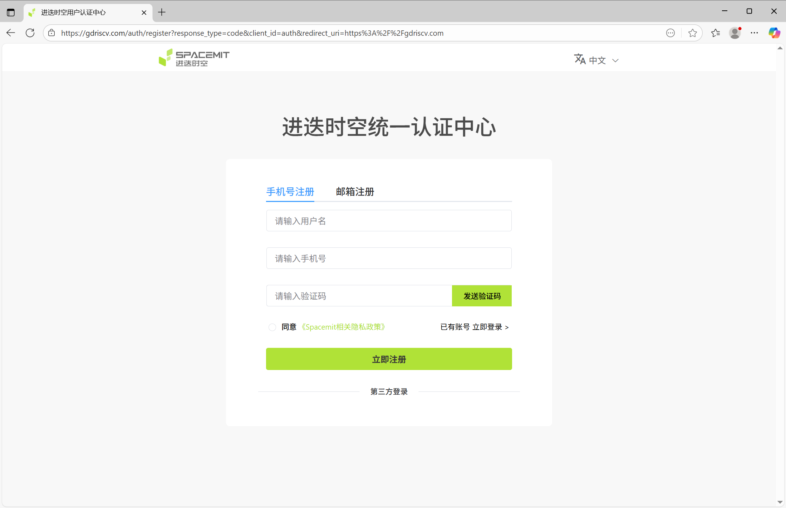

### 邮箱注册

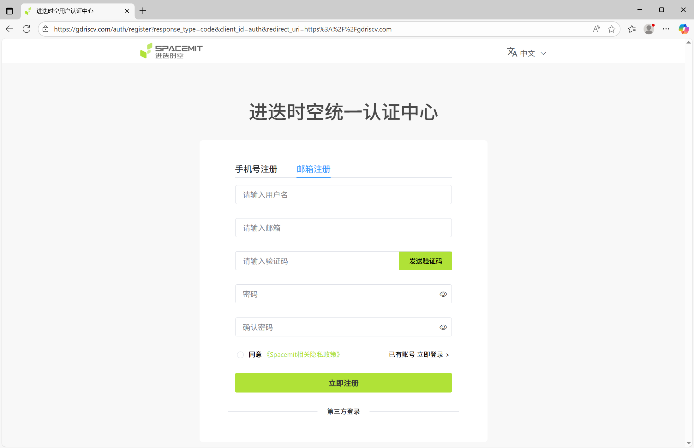

### 登录

注册成功后点击 **“立即登录”**，进入登录页面，支持 **短信登录** 与 **密码登录**。


成功登录后进入系统主界面：
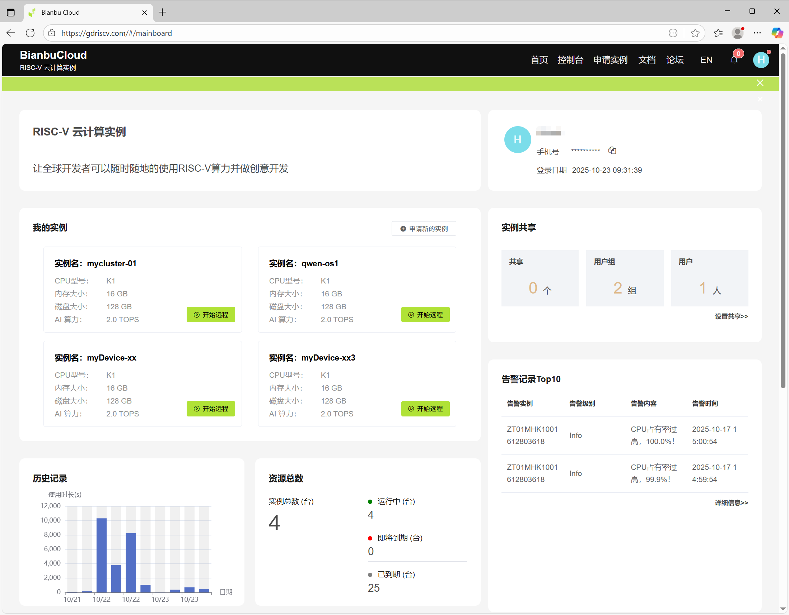

## 2. 申请新实例

在系统主界面点击 **“申请实例”** 进入实例创建页面。
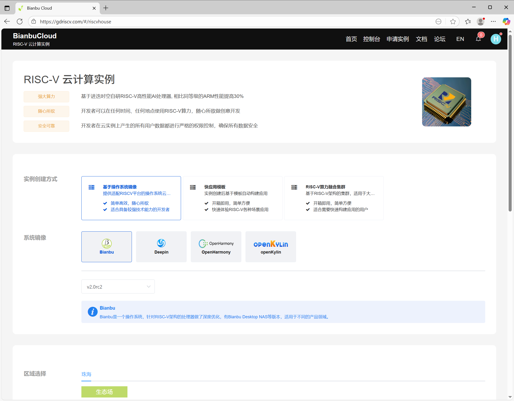

### 2.1 实例类型

系统支持多种方式创建实例，包括不同的操作系统镜像、快应用模板以及 RISC-V 算力集群等。

#### 基于操作系统的镜像

包含：

- Bianbu
- Deepin
- OpenHarmony
- openKylin

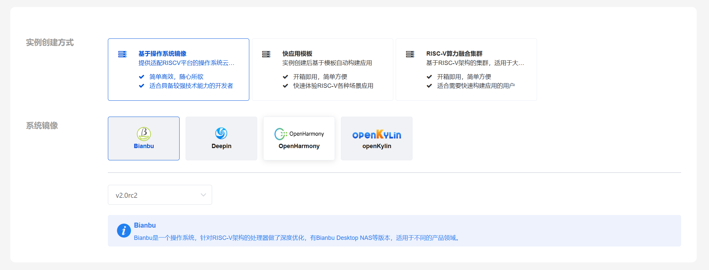

#### 基于快应用模板的实例

包含：

- 通义 Qwen 大模型
- Deepseek 大模型
- 在线 Python 开发环境 JupyterLab

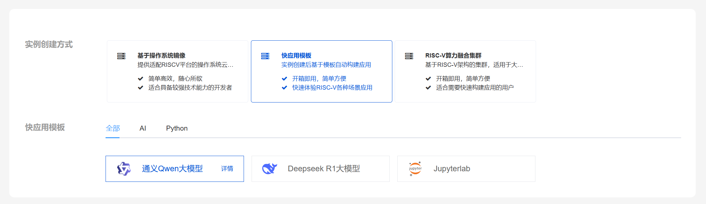

#### 基于 RISC-V 算力融合集群的实例


### 2.2 实例名称

输入自定义实例名称，并勾选同意隐私协议。

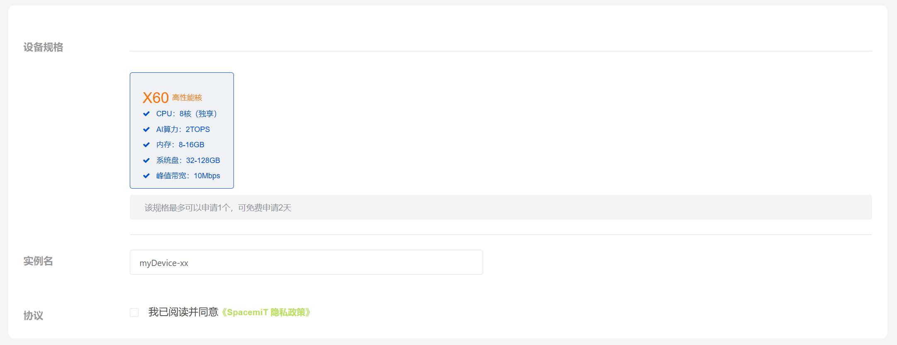

### 2.3 申请时长


- **非会员**
  可选：48 小时 / 7 天 / 1 个月

- **会员**
  最长可选：3 个月

## 3. 远程实例

### 3.1 命令行访问

申请成功后，可在控制台查看当前账户拥有的实例：


点击实例卡片查看实例详情及功能按钮。


点击 **“开始远程”** 进入命令行界面：


命令行界面支持：

- 多会话
- 分屏

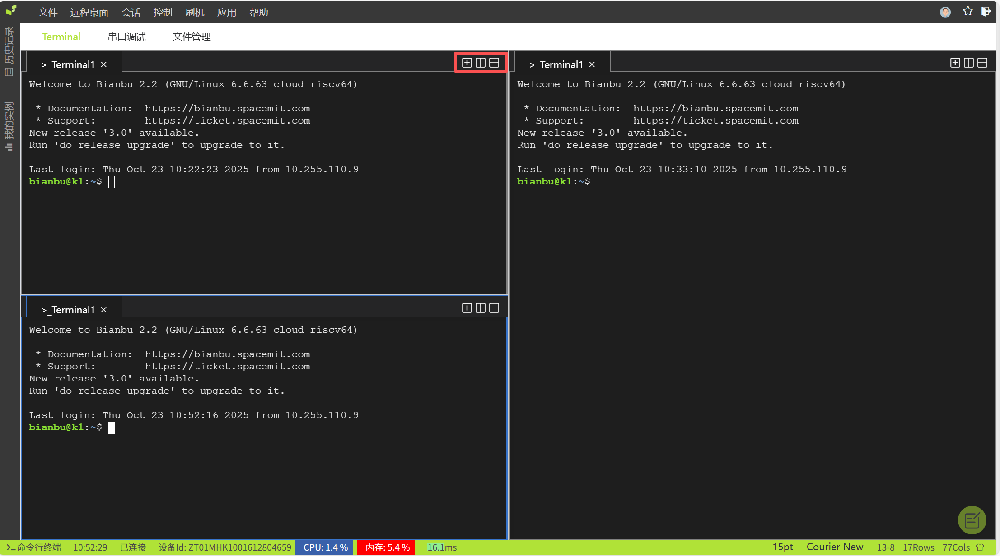

点击右上角 **“退出”** 返回主界面。


### 3.2 串口调试

在工作台点击 **“串口调试”** 按钮进入串口界面。


### 3.3 文件操作

工作台左上角点击 **“文件”** 可打开文件树或文件管理器：

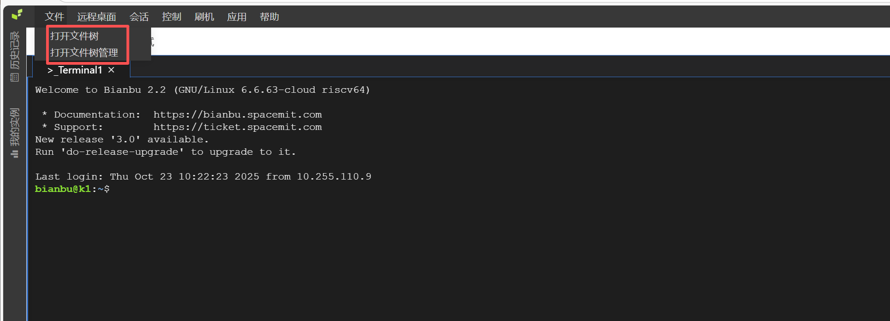

在文件树中右键目录或文件，可执行：

- 上传
- 下载
- 刷新
- 新建文件/目录

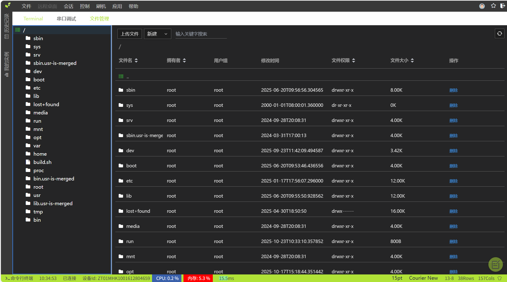

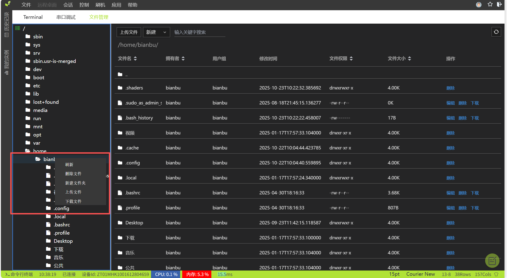

双击文件（例如 `.profile`）可在线编辑：


修改完成后点击右上角 **“保存”**。


### 3.4 远程桌面

在工作台顶部点击 **“远程桌面”** 开启或关闭远程桌面模式。
若按钮为禁用状态，请先切回 Terminal 或串口界面。

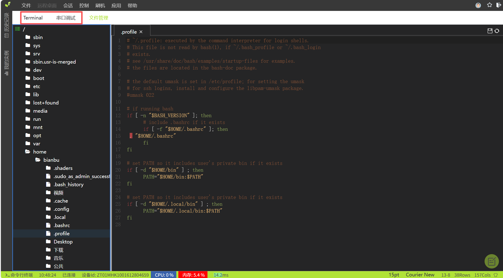


远程桌面支持：

- 尺寸调整
- 全屏模式

### 3.5 实例重启

点击顶部 **“控制”** 按钮，可选择：

- 电源重启
- 系统重启


### 3.6 实例刷机

如下图，点击工作台顶栏 **“刷机”** 按钮，可以选择 **打开刷机面板** 和 **关闭刷机面板**，在右侧镜像列表中选择指定镜像点击 **烧写按钮** 进行刷机


### 3.7 Code Server 应用

工作台顶部点击 **应用 → code-server**：

- **打开**：启动 Code Server 在线 IDE 应用
- **关闭**：停止 Code Server


#### Python 插件安装

在左侧扩展中搜索 `python` 即可安装对应的 python 插件：

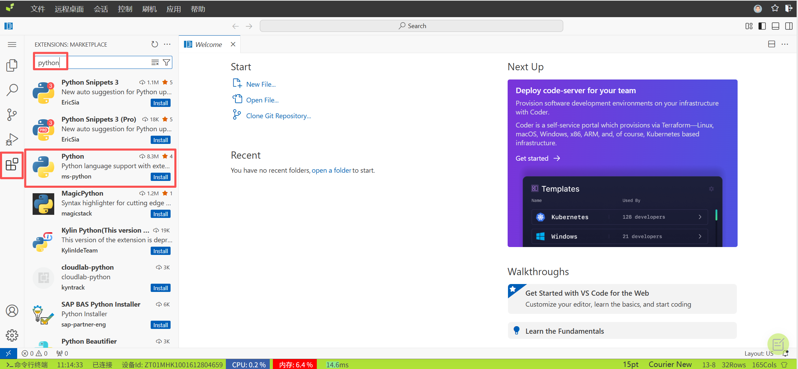

安装完成后可进行 Python 开发：

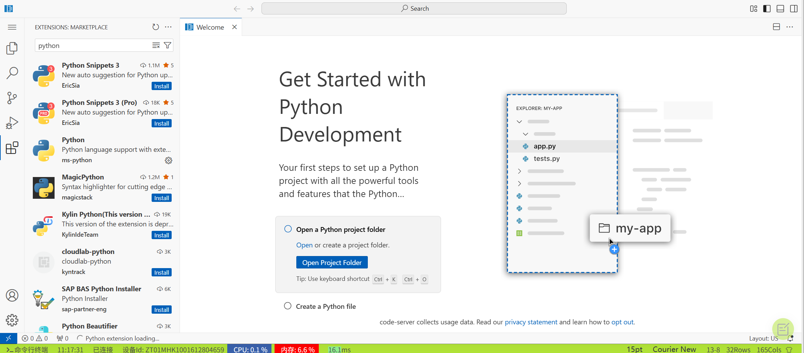

### 3.8 JupyterLab 应用

点击工作台顶栏 **应用 → JupyterLab**：

- **打开**：进入 JupyterLab
- **关闭**：退出 JupyterLab

**注：** 此应用仅在快应用模板中的 JupyterLab 实例支持，其他操作系统和AI镜像没有此应用。

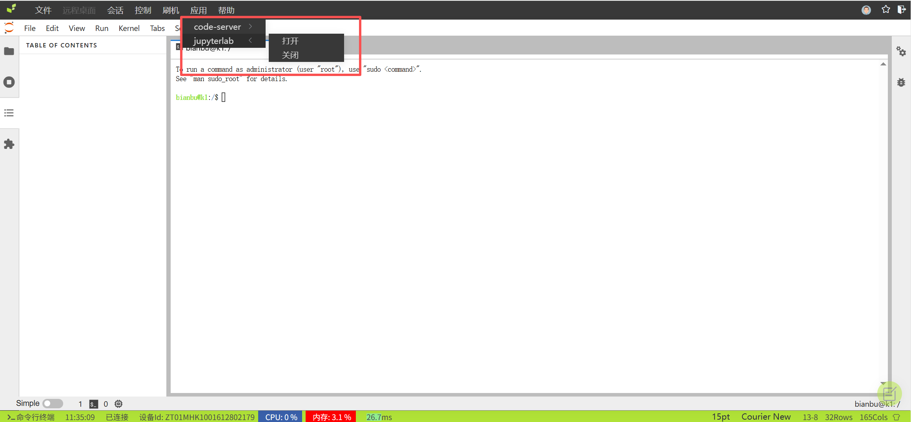

### 3.9 通义 Qwen 大模型应用

点击工作台顶栏 **应用 → qwen-ai**：

- **打开**：进入 Qwen 应用
- **关闭**：退出 Qwen

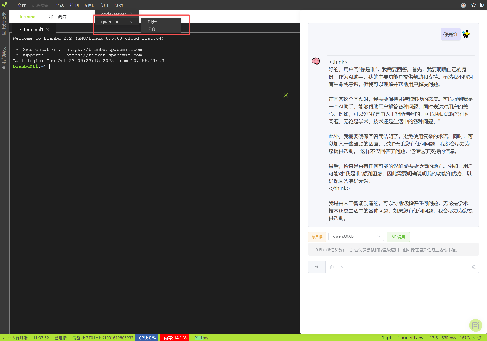

也可使用右侧 **AI** 按钮操作。


### 3.10 Deepseek 大模型应用

点击工作台顶栏 **应用 → deepseek-ai**：

- **打开**：进入 Deepseek 应用
- **关闭**：退出 Deepseek

同样支持右侧 **AI** 按钮操作。

## 4. 账户管理

在系统页面右上角点击用户图标进入账户管理：

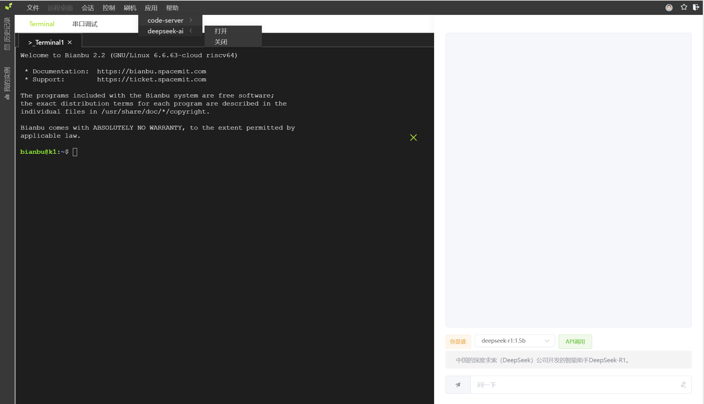

### 4.1 修改个人信息

在系统控制台页面，点击右上角 **用户图标** 跳转到 **账户管理界面**

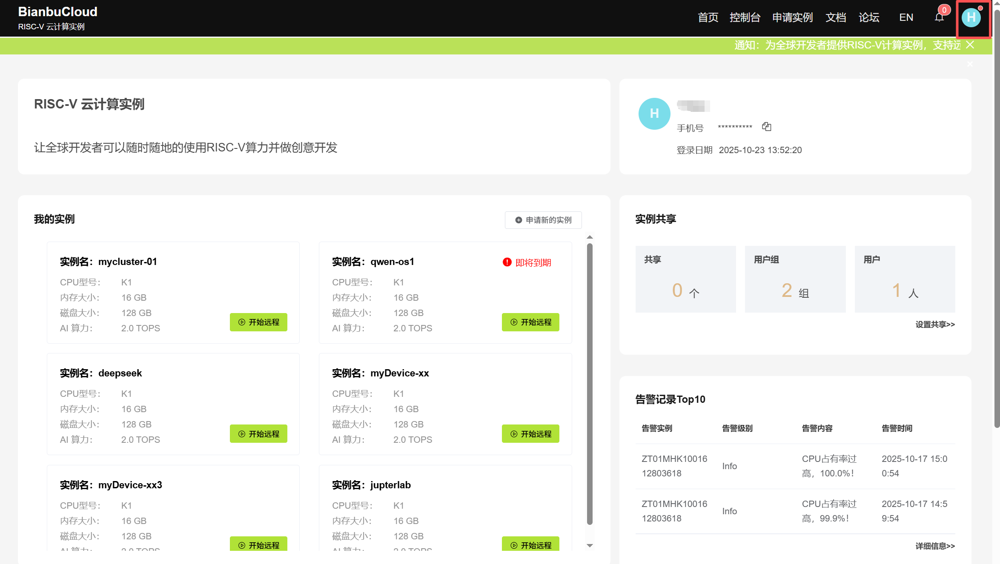

在账户设置页面点击 **“编辑个人信息”**：

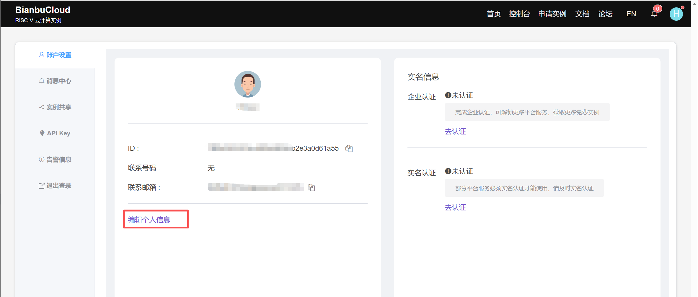

如下图，可修改：

- 用户名
- 密码
- 手机号
- 邮箱


示例，修改手机号码


保存后点击 **返回系统** 即可回到 账户管理界面。

### 4.2 消息中心

在账户管理界面，点击左侧 **消息中心** 页签即可查看系统消息

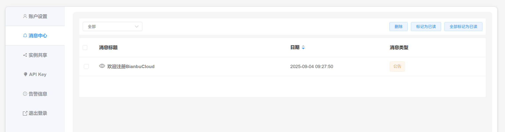

### 4.3 实例共享

在账户管理界面，点击左侧 **实例共享** 页签即可进行实例共享操作，可将个人实例共享至其他用户。


### 4.4 API Key 管理

在账户管理界面，点击左侧 **API Key** 页签即可进行 API Key 管理，API Key 用于远程调用实例的API接口。

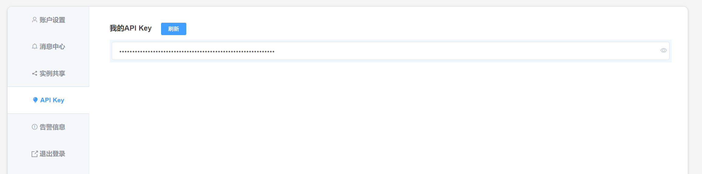

### 4.5 告警信息

在账户管理界面，点击左侧 **告警信息** 页签即可查看实例的告警状态。

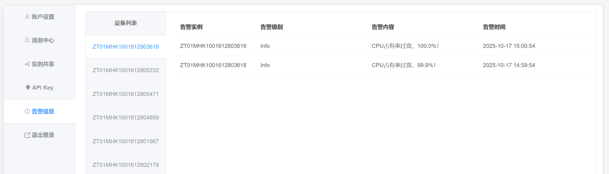

## 5. 本地连接

### 5.1 SSH 直连

系统支持本地SSH直连实例，SSH 直连需启用 **TLS 隧道**，建议使用 Stunnel。

#### 客户端安装

- Windows: [https://www.stunnel.org/downloads/stunnel-latest-win64-installer.exe](https://www.stunnel.org/downloads/stunnel-latest-win64-installer.exe)
- Ubuntu/Debian:

  ```bash
  sudo apt install stunnel4
  ```

- CentOS/RHEL:

  ```bash
  sudo yum install stunnel
  ```

#### 获取 Stunnel 配置

在控制台点击实例卡片

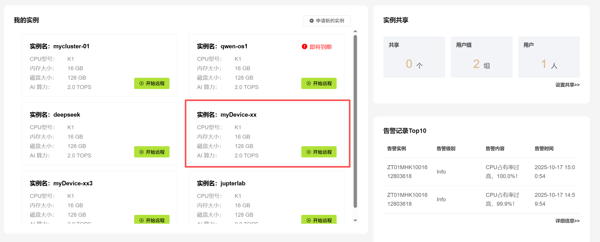

点击 **本地连接** 按钮， 即弹出连接信息和教程页面


如下图，配置信息复制到 Stunnel 客户端的配置文件中，并启动 Stunnel 或者 reload


人下图，Linux 可以直接使用 Stunnel 配置文件启动即可

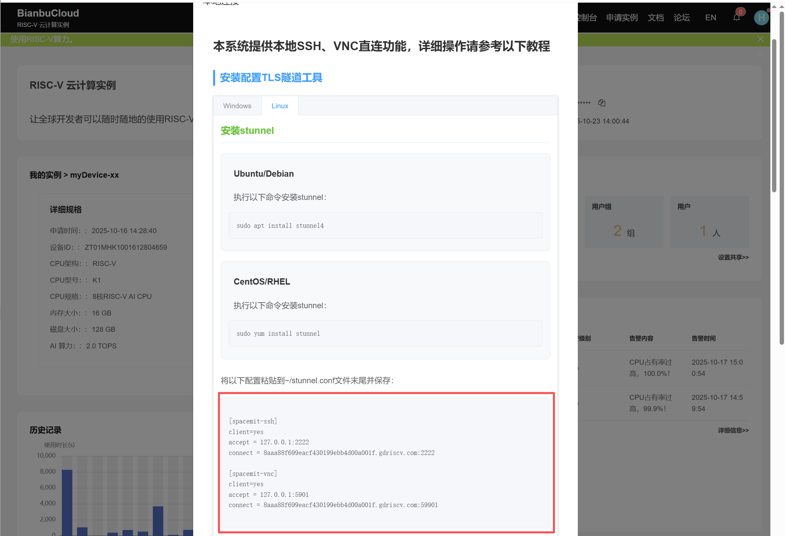

#### SSH 连接方式

- 使用 CMD 命令行连接, 示例如下：

   ```bash
   ssh -p 2222 root@localhost
   ```

   

- 使用 MobaXterm：
    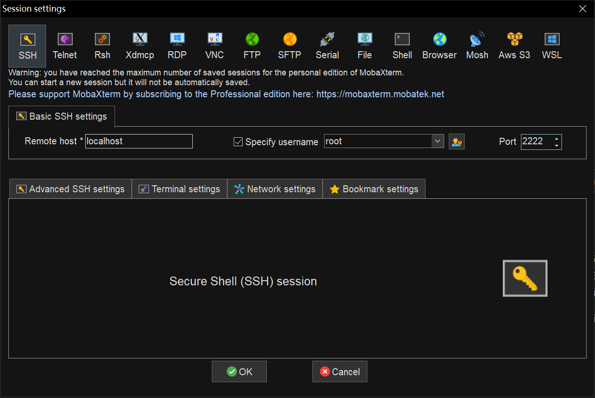

   MobaXterm 需要指定 SSH 协议版本为 **SSHv2**。
  - 上图里，选择 **Advanced SSH settings** 标签
  - 点击 **Expert SSH settings** 按钮
  - 选择 **SSH protocol version** 为 **SSHv2**
  
  

  - 点击 **OK** 即可连接

#### 用户密码

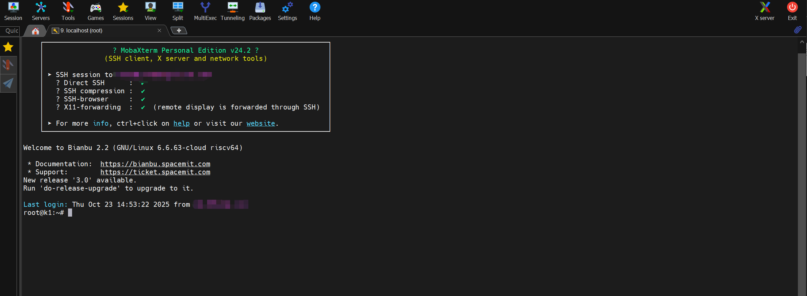

用户密码在上面的 **连接信息** 和教程页面末尾找到

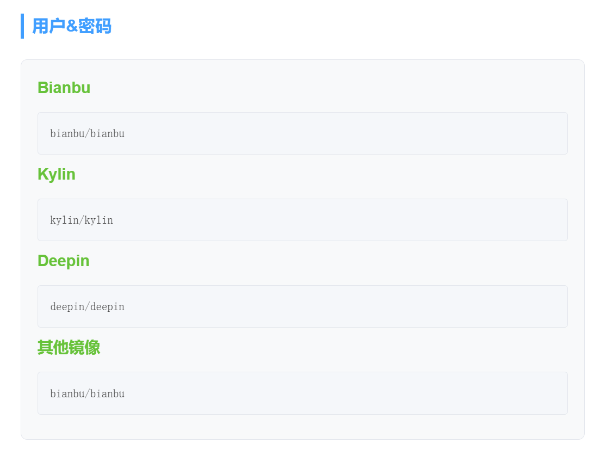

### 5.2 VNC 直连

与 SSH 一样需配置 Stunnel。

以 MobaXterm 为例

- 配置好 Stunnel
- 点击左边的 **Session** 按钮，选择 **VNC**
- 地址输入框输入 `localhost`，端口填入 `5901`，点击 **OK** 连接即可
- 如需密码请参考上一节 SSH 部分 **用户密码** 说明

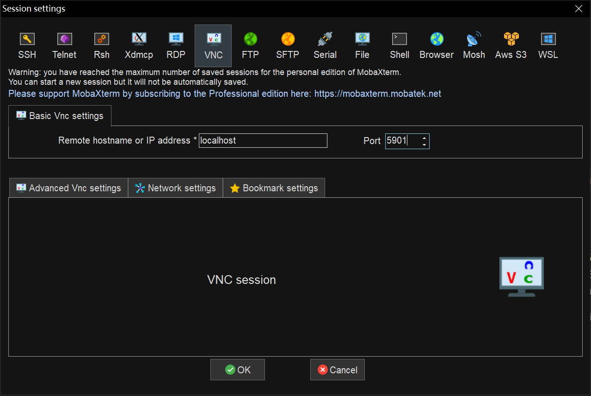

成功连接如下图

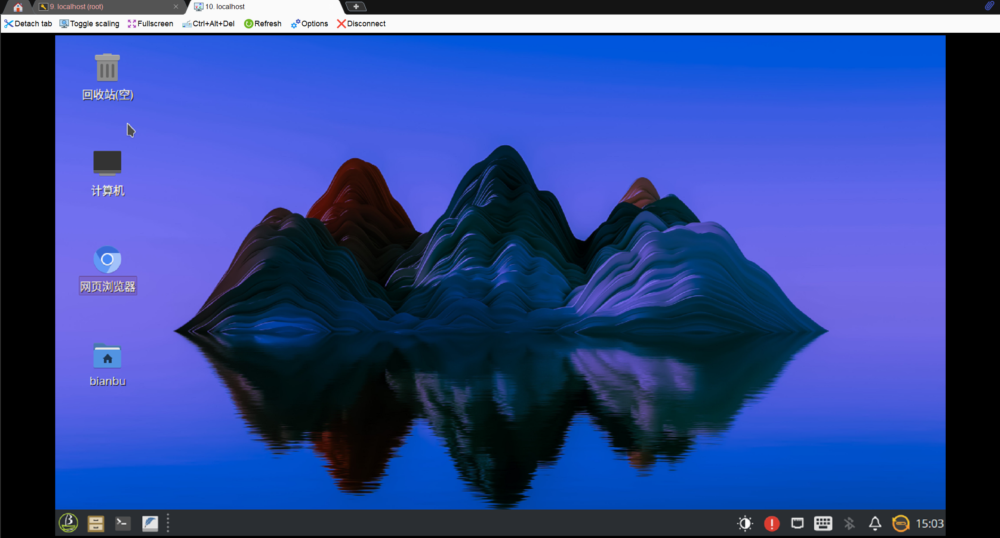

## 6. API 调用

### 6.1 Ollama 接口调用

本功能目前仅支持：

- 通义 Qwen 大模型实例
- Deepseek 大模型实例

根据章节 [3.1 命令行访问](#31-命令行访问) 进入到实例工作台之后，点击右侧的 **API 调用** 按钮即可弹出配置页面

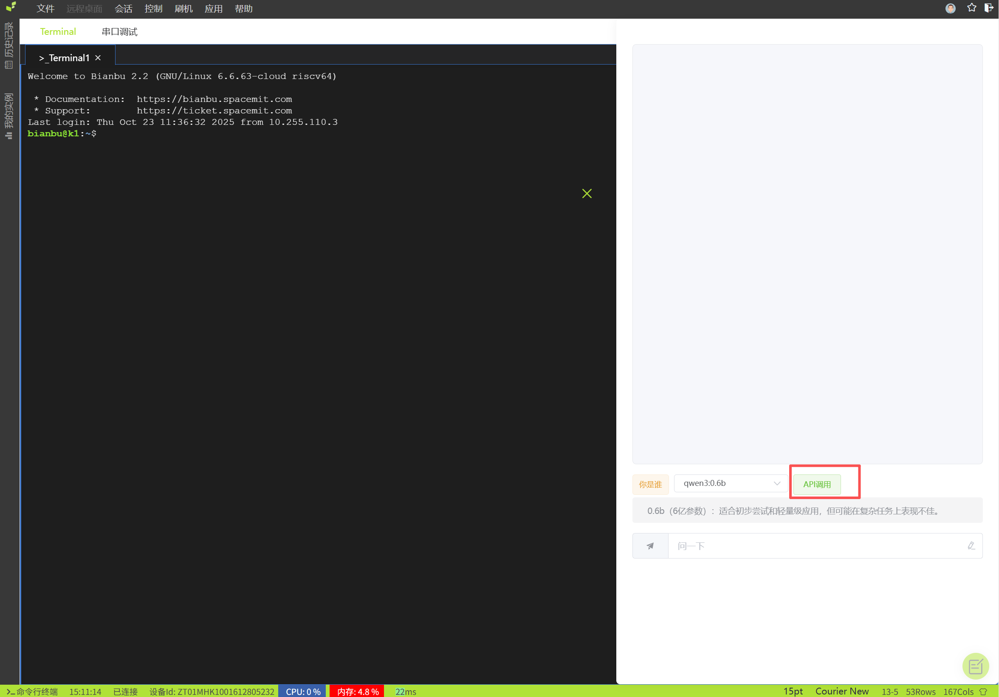

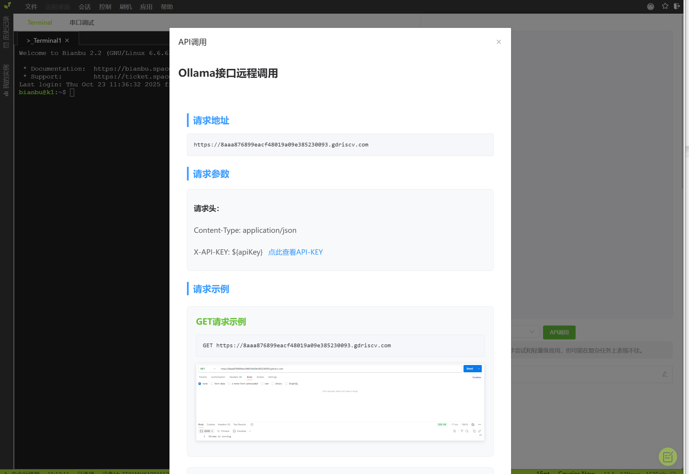

设置请求头后，可通过给定 URL 调用 Ollama 接口：


### 6.2 自定义接口调用

实例支持通过指定的端口 `18080` 部署并访问自定义服务。

示例：运行 Python HTTP 服务：

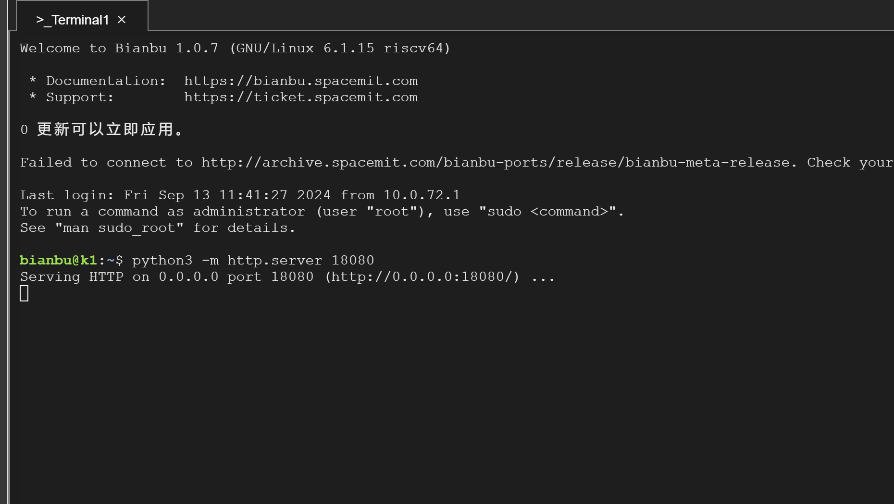

使用 Postman 模拟请求实例的 Get 或 Post 接口，deviceId 为实例的设备 ID：


API Key 参考章节 [4.4 API Key 管理](#44-api-key-管理) 中获取：


请求地址格式：

```
https://gdriscv.com/api/remote/{deviceId}
```

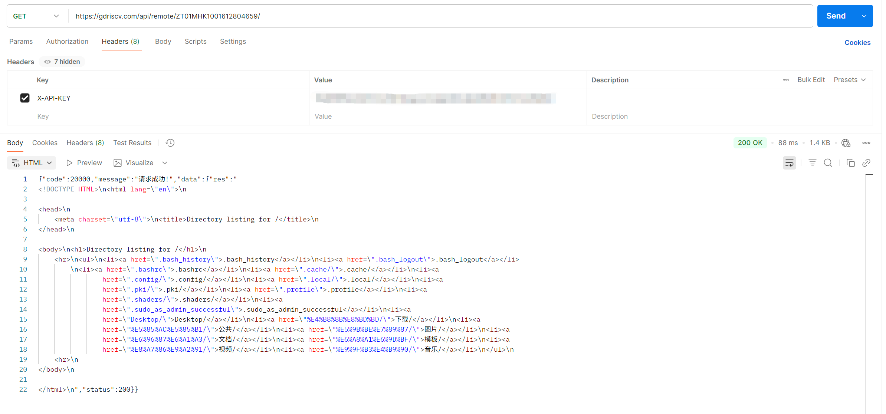

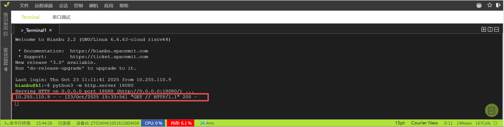

## 7. 开发示例

### 7.1 RISC-V 汇编开发

#### RVV 编程

RVV（RISC-V Vector）扩展用于高性能向量计算，与 ARM NEON 存在差异：

| 特性 | SVE (ARM) | RVV (RISC-V) |
| --- | --- | --- |
| 指令集架构 | ARM v8/v9 的扩展 | RISC-V 的官方矢量扩展（V 扩展） |
| 设计哲学 | 硬件透明性优先，强调代码兼容性 | 灵活性与可配置性优先，允许硬件定制 |
| 寄存器结构 | 独立的谓词寄存器（P0-P15）+ Z 寄存器 | 通用寄存器复用为掩码，矢量寄存器可配置，简化设计 |
| 最小实现要求 | 必须支持 128 位矢量 | 无固定最小长度，支持从 128 位到任意扩展 |
| 编程模型 | 强调编译器自动优化（如自动矢量化） | 更多暴露硬件细节，支持手动优化 |
| 数据类型支持 | 支持 FP32/FP64、INT8/16/32/64 等 | 支持 FP16/32/FP64、INT8/16/32/64 等，允许配置裁剪 |
| 内存访问模式 | 支持复杂寻址 | 更强调显式内存操作 |
| 应用场景 | ARM生态的高性能计算（服务器、超算） | RISC-V的定制化场景（AIoT、边缘计算） |

核心代码示例：

```c
void vector_add_rvv(int32_t* vec1, int32_t* vec2, int32_t* result, size_t size) {
    // 设置向量长度
    size_t v1;

    for (size_t i = 0; i < size; i += v1) {
        // 动态设置向量长度，如果__riscv_vsetvlmax_e32m4()>size-i，长度会被设置为size-i，否则会被设置为__riscv_vsetvlmax_e32m4()
        v1 = __riscv_vsetvl_e32m4(size - i);

        vint32m4_t v1 = __riscv_vle32_v_i32m4(&vec1[i], v1);  // 加载 vec1
        vint32m4_t v2 = __riscv_vle32_v_i32m4(&vec2[i], v1);  // 加载 vec2
        vint32m4_t vresult = __riscv_vadd_vv_i32m4(v1, v2, v1);  // 向量加法
        __riscv_vse32_v_i32m4(&result[i], vresult, v1);  // 存储结果
    }
}
```

在云实例中通过 Code Server 编辑代码：

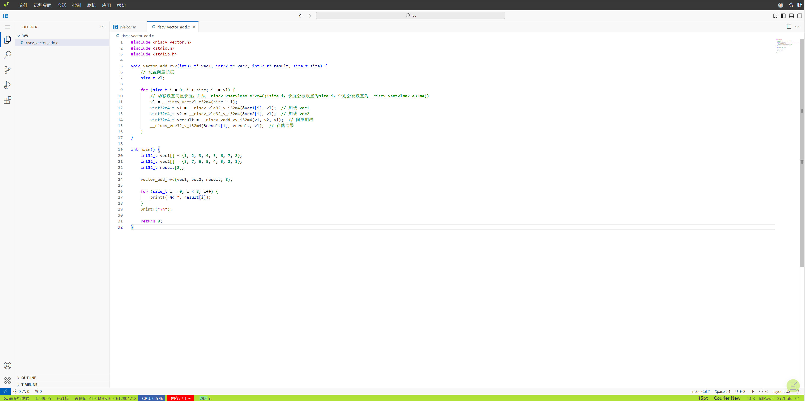

通过 gcc 编译与运行，示例结果如下：


#### RISC-V AI 指令编程

K1是一款8核RISCV AI-CPU。在RISCV开源指令集的基础上，K1增加了通用AI能力，可以提供50 KDMIPSCPU算力和2.0 TOPS的AI算力。通过将AI算力集成在CPU核内，K1可以实现对所有主流AI生态系统的快速融合。此外，K1支持RISC-V Vector 1.0标准，提供256-bit的向量计算带宽，可以提供2倍于ARM NEON的SIMD并行处理能力。


核心代码示例：


通过 Code Server 编辑并编译：

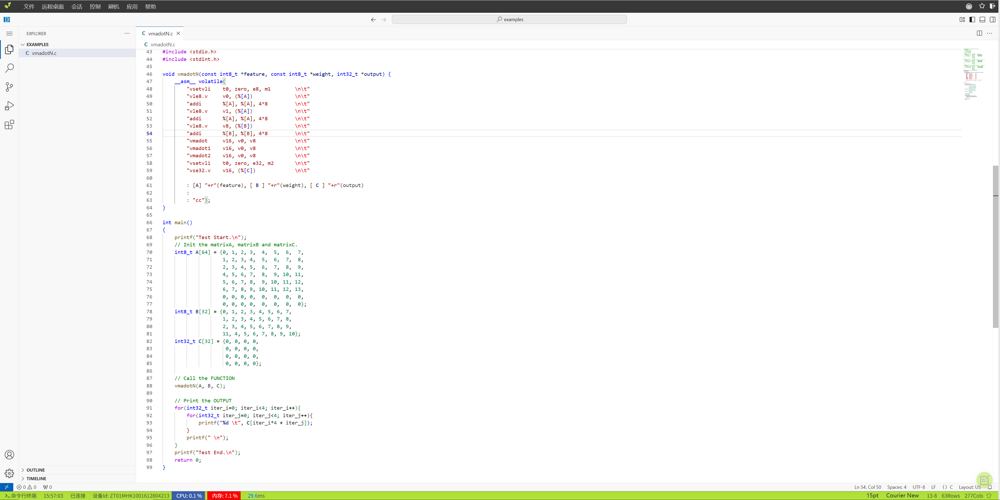

运行结果：

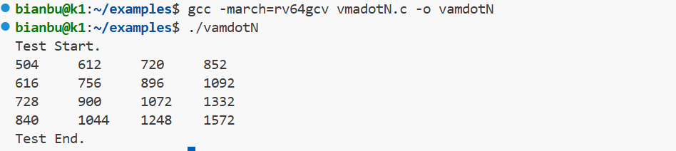

#### 卷积优化示例

卷积神经网络（CNN）是一种深度学习模型，常用于解决图像识别问题。相较于全连接神经网络，卷积神经网络采用局部感知性和参数共享的方式，通过卷积核的滑动和权值共享，可以有效减少参数数量和计算量，提高模型的泛化能力。其广泛应用于图像分类、目标检测、图像分割等领域。卷积神经网络在图像处理领域的应用不仅提高了图像处理的效率和准确性，也推动了人工智能技术在视觉领域的发展和应用。

1×3 卷积核心代码示例：

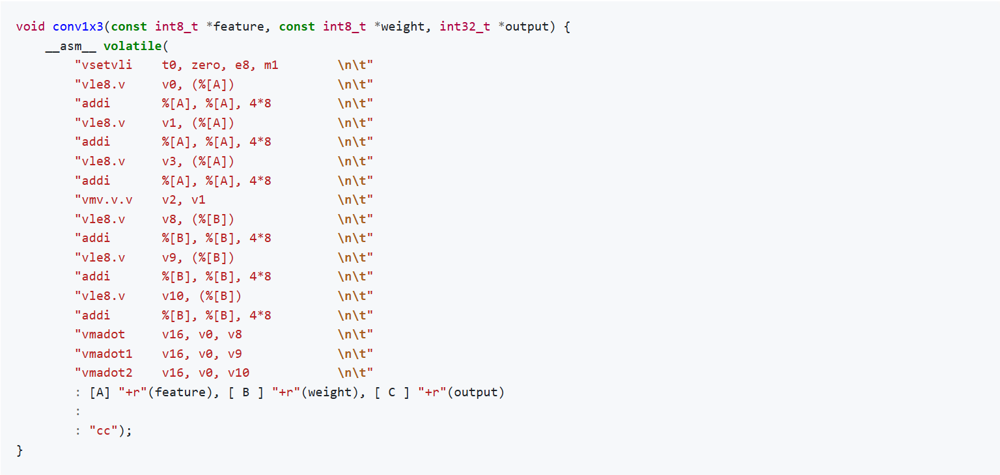

在云实例中编辑：

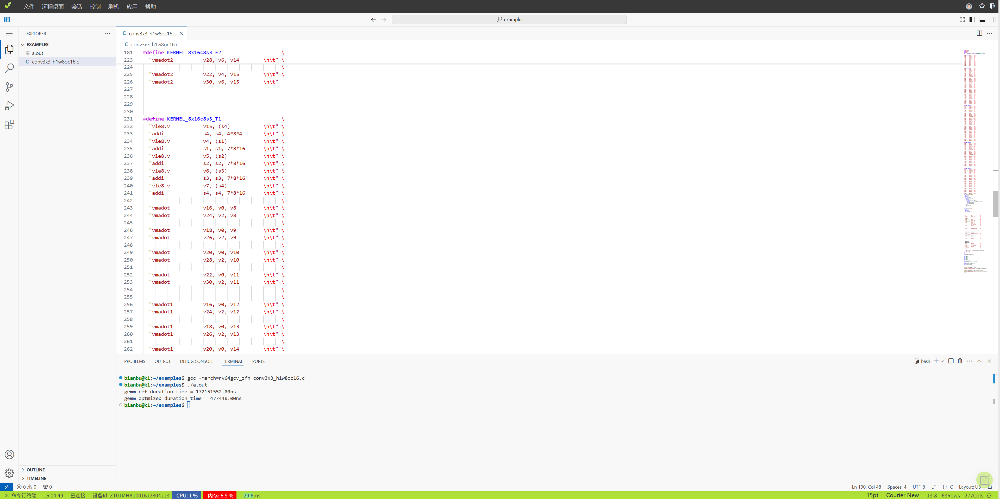

运行结果：

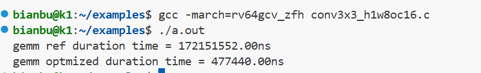

## 7.2 AI 开发

### YOLOv8 姿态识别

YOLOv8-pose 是 Ultralytics 团队在 YOLOv8 基础上开发的用于人体姿态估计（Human Pose Estimation） 的模型，能够实时检测图像或视频中的人体，并同时预测人体关键点（如关节、四肢端点等）的位置。它继承了 YOLO 系列 “单阶段检测” 的高效特性，在精度和速度上都表现优异，广泛应用于动作识别、运动分析、人机交互等场景。本例子介绍基于RISC-V AI算力和优化的RISC-V vector1.0 的性能下姿态识别开发示例：

#### 下载代码

```bash
git clone https://gitee.com/bianbu/spacemit-demo.git
```

#### 下载模型

```bash
cd spacemit-demo/examples/CV/yolov8-pose/model
sh download_model.sh
```

脚本会下载：

- FP32: `yolov8n-pose.onnx`
- INT8: `yolov8n-pose.q.onnx`

#### 创建环境并安装依赖

```bash
python3 -m venv <env>
source <env>/bin/activate
pip install -r requirements.txt --index-url https://git.spacemit.com/api/v4/projects/33/packages/pypi/simple
```

#### 编辑代码

云实例打开code-server编辑代码:

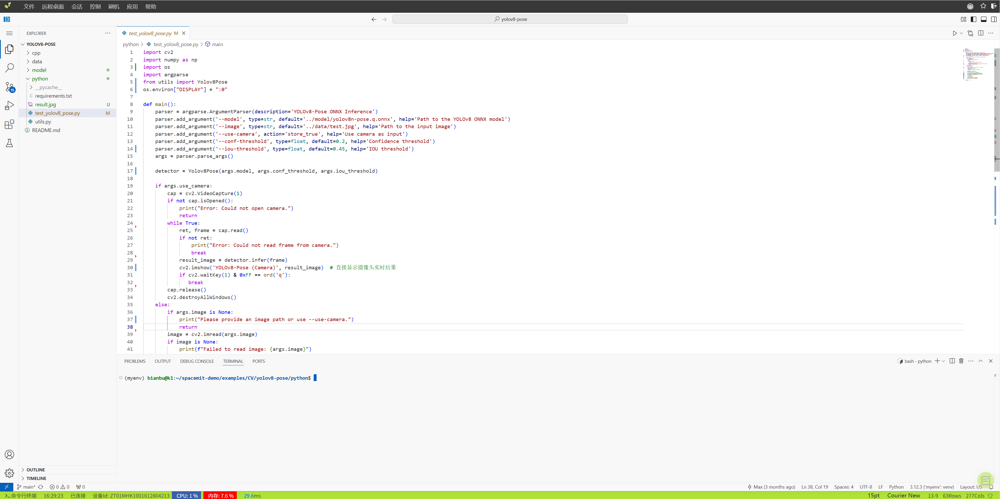

#### 运行

```bash
python test_yolov8_pose.py
```

示例结果如下

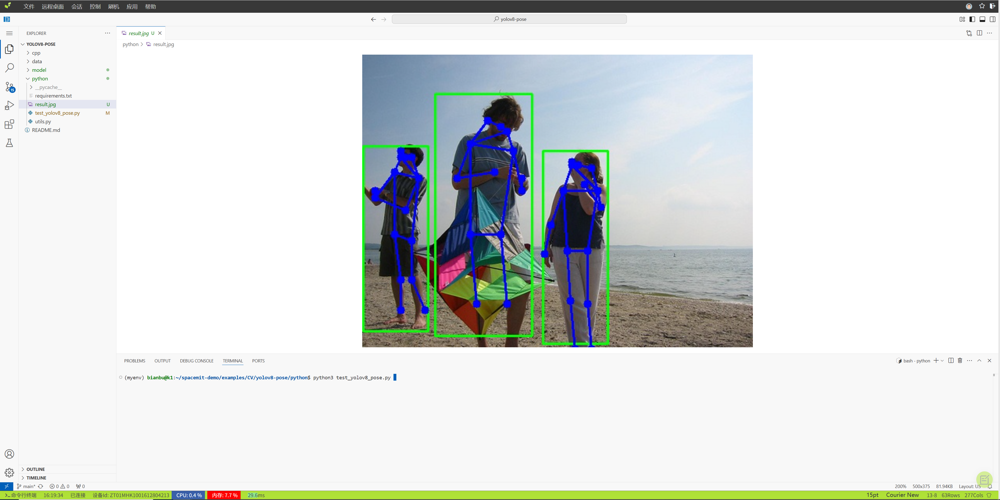

### YOLOv5-face 人脸检测

YOLOv5-face 是基于 YOLOv5 改进的人脸检测模型，专注于高精度、实时的人脸检测任务。它在 YOLOv5 基础架构上针对人脸检测的特点（如人脸尺度小、密集分布、姿态多样等）进行了优化，能够高效检测图像或视频中的人脸，并输出边界框（bounding box），广泛应用于人脸验证、监控安防、表情分析等场景。

本例子介绍基于 RISC-V AI 算力和优化的 RISC-V vector1.0 的性能下人脸识别开发示例。

#### 下载示例代码与模型

```bash
git clone https://gitee.com/bianbu/spacemit-demo.git
cd spacemit-demo/examples/CV/yolov5-face/model
sh download_model.sh
```

#### 创建环境并安装依赖

```
python3 -m venv name(虚拟环境名) 
source name/bin/activate 
pip install -r requirements.txt --index-url https://git.spacemit.com/api/v4/projects/33/packages/pypi/simple
```

#### 编辑与运行

在 code-server 打开并编辑代码 `test_yolov5-face.py`：

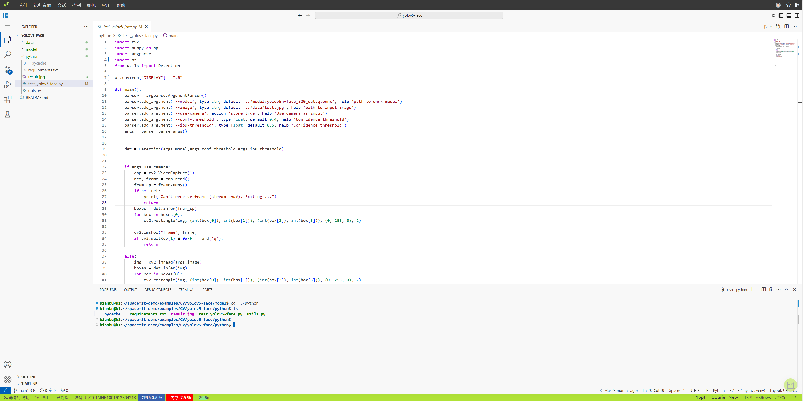

示例结果如下


### 7.3 OCR 识别

基于 K1 RISC-V 深度优化的 OpenCV OCR 识别功能。

示例如下

#### 下载示例代码

```bash
git clone https://gitee.com/bianbu/spacemit-demo.git
```

#### 下载模型

执行模型下载脚本

```bash
cd spacemit-demo/examples/CV/ocr/model
sh download_model.sh
```

执行测试数据下载脚本

```bash
cd data
sh download_data.sh
```

在云实例打开 code-server 编辑 `test_ocr.py` 代码：

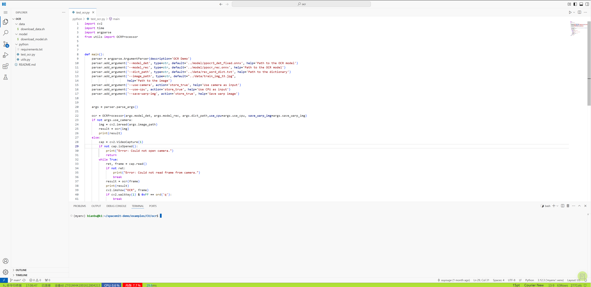

#### 创建环境并安装依赖

```
python3 -m venv name(虚拟环境名) 
source name/bin/activate 
pip install -r requirements.txt --index-url https://git.spacemit.com/api/v4/projects/33/packages/pypi/simple
```

#### 编辑与运行

执行代码从 log 打印可看出识别结果


好的，这里是 **经过专业技术写作方式优化后的中文版本**，结构清晰、表达专业，可直接用于技术文档或 GitHub：

## 7.3 OpenHarmony 调试

### 申请在线实例并进行远程连接

申请 OpenHarmony 在线实例后，可通过远程桌面进行开发与调试操作。


### 查看日志（hilog）

在远程环境中，执行以下命令即可实时查看系统日志：

```bash
hilog
```

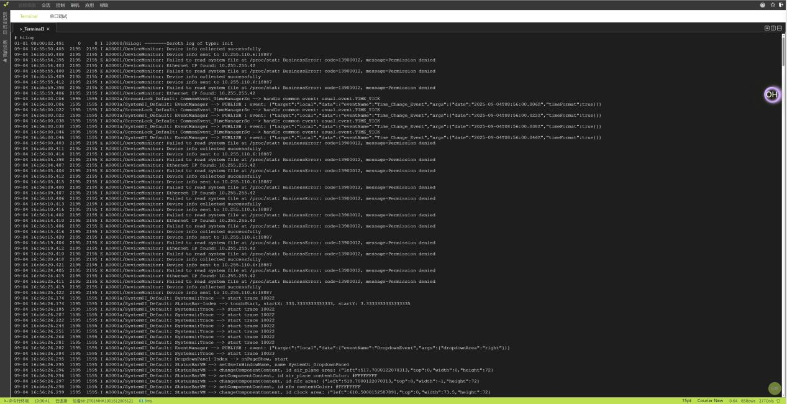

### 应用文件管理（上传 / 安装 / 删除 / 查看）

在远程桌面右下角的工具区域，可以对应用文件进行：

- 上传
- 安装
- 删除
- 查看

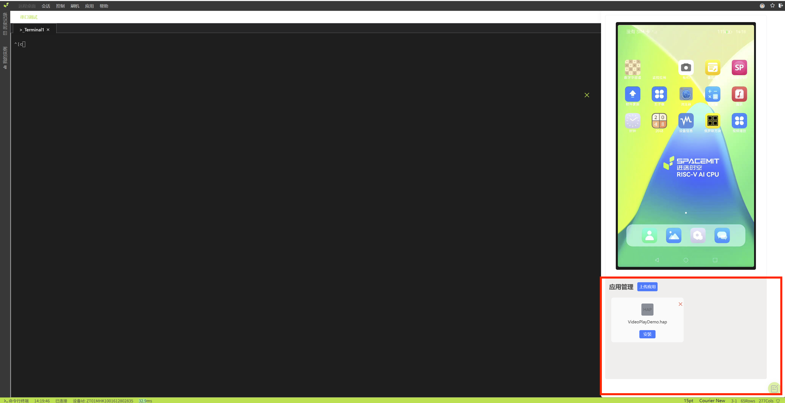

### 应用卸载

在远程桌面上选中目标应用图标，**鼠标左键长按**，当出现卸载选项后即可执行卸载。


### 应用安装

点击工具区域中的 **“安装”** 按钮，选择待安装的应用包即可完成安装流程。

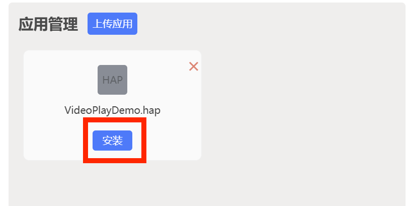

### 查看安装日志

安装过程中，可通过如下命令查看安装相关日志：

```bash
hilog | grep bm
```

如果日志中出现 `bm output`，则说明应用安装成功。


### 查看应用运行日志

```bash
hilog | grep "xxx"
```

示例：

```bash
hilog | grep "VideoPlay"
```


### 大模型开发

Ollama 以及 MCP开发（待补充）

### GUI 开发

基于RISC-V在线环境QT开发、Electron开发 （待补充）
